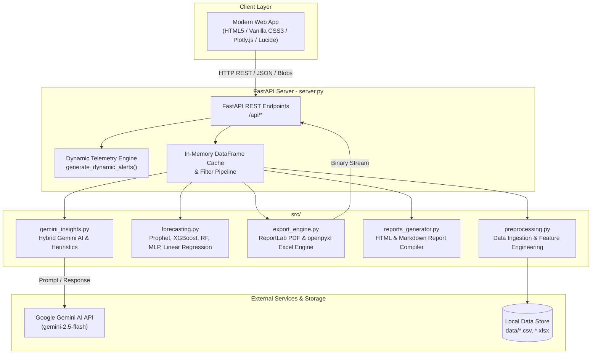

# Intelligent Sales Forecasting & Business Intelligence Dashboard

[](https://www.python.org/)
[](https://fastapi.tiangolo.com/)
[](https://plotly.com/javascript/)
[](https://www.reportlab.com/)
[](https://openpyxl.readthedocs.io/)
[](https://ai.google.dev/)
[](tests/test_components.py)
[](LICENSE)

An enterprise-grade, sales forecasting and predictive business intelligence platform. Built with a high-performance **FastAPI** asynchronous REST backend, a sleek **Vanilla JS + CSS3 Glassmorphic** frontend UI with Plotly.js visualizations, and automated **Executive PDF & Excel Reporting Engines**.

Powered by 5 machine learning forecasting engines with dynamic benchmark evaluation and hybrid **Google Gemini AI** strategic insights.

---

## 🌟 Key Features

### 1. 📊 Executive BI Dashboard & Telemetry
- **Real-Time Financial KPIs**: Instant calculation of Gross Revenue, Operating Profit, Total Units Sold, Average Order Value (AOV), and Operating Profit Margin.
- **Dynamic Year-over-Year (YoY) Growth Indicators**: Calculates period-over-period percentage expansion/contraction with contextual badge styling.
- **Data-Driven Dynamic Alerts**: Real-time risk detection engine analyzing month-over-month sales velocity, product margin compression (<25%), price elasticity erosion, and transaction variance anomalies.
- **Interactive Global Distribution**: Country-level choropleth visualization and category contribution donut charts.
- **Top Product Matrix**: Ranking of top revenue drivers with volume, unit price, and portfolio share breakdown.

### 2. 🤖 5 Machine Learning Forecasting Engines
- **Prophet / Seasonal-Trend Decomposition**: Models annual/weekly seasonality, growth saturation, and long-term trend trajectories with upper/lower confidence bounds.
- **XGBoost Regressor**: Gradient boosting machine utilizing lagged sales features, rolling averages, and L1/L2 regularization.
- **Random Forest Regressor**: Detrended non-linear ensemble with bootstrap aggregation and leaf regularization.
- **Multi-Layer Perceptron (MLP Neural Network)**: Feed-forward deep architecture with feature standardization and detrended residual learning.
- **Linear Regression Baseline**: Fast ordinary least squares benchmark model.
- **Dynamic Model Evaluation**: Real-time comparative ranking across Mean Absolute Error (MAE), Root Mean Squared Error (RMSE), and Coefficient of Determination ($R^2$).

### 3. ⚡ What-If Revenue Scenario Simulator
- Test revenue sensitivity against real-world business interventions.
- Interactive multi-parameter adjustments:
  - **Promotional Discount Tuning** (e.g., assessing margin erosion vs. unit velocity).
  - **Marketing Spend Scaling** (calculating incremental CAC and return on ad spend).
  - **Price Elasticity Shifts** (modeling customer demand reactions).

### 4. 📑 Enterprise Multi-Format Export Engine
- **Executive PDF Reports (`src/export_engine.py`)**:
  - Generated on-the-fly via ReportLab with corporate branding, custom typography, KPI summary cards, tabular financial performance, and executive commentary.
  - Supports direct browser download with native attachment headers.
- **Multi-Tab Excel Workbooks (`openpyxl`)**:
  - Formatted workbooks featuring an **Executive Summary** tab (styled KPI blocks, category totals with Excel `SUM` formulas, currency formatting) and a raw **Sales Transactions** ledger tab.
  - Formatted headers, alternating zebra striping, and auto-fitted column widths.
- **Interactive HTML Reports (`src/reports_generator.py`)**:
  - In-browser printable preview with executive, regional, or category-specific focus.

### 5. 🧠 Hybrid AI Strategic Insights
- Seamlessly connects to **Google Gemini AI** (`gemini-2.5-flash` or `gemini-1.5-flash`) via official SDK and fallback endpoints.
- Synthesizes sales trajectory, territory performance, and margin risks into four executive-ready bullet points.
- **Heuristic Fallback Engine**: If an API key is omitted or the service encounters rate limits/outages, the system automatically falls back to deterministic rule-based business logic without crashing.

### 6. 📁 Universal Data Ingestion & Auto-Mapping
- Drag-and-drop support for custom **CSV** and **Excel (.xlsx, .xls)** datasets.
- Smart schema heuristic detector automatically recognizes Date and Sales Revenue columns regardless of naming conventions (`TransactionDate`, `Order_Date`, `Total_Amount`, `Gross_Sales`, etc.).
- One-click dataset reset to default benchmark sample data.

---

## 🏗️ System Architecture



---

## 📁 Repository Structure

```text
intelligent-sales-forecasting-dashboard/
├── server.py                     # High-performance FastAPI backend & REST routes
├── requirements.txt              # Production and development dependencies
├── README.md                     # Comprehensive technical documentation
├── .env                          # Local environment variables configuration
├── frontend/                     # Modern Web Client Application
│   ├── index.html                # Responsive layout, modals, and metric components
│   ├── app.js                    # State management, Plotly rendering, API fetch orchestration
│   └── style.css                 # Glassmorphism dark design system, micro-animations
├── src/                          # Modular Analytics & ML Core
│   ├── export_engine.py          # Corporate PDF (ReportLab) & Excel (openpyxl) generation
│   ├── forecasting.py            # 5 ML forecasting models (Prophet, RF, XGB, MLP, Linear)
│   ├── preprocessing.py          # Data validation, cleaning, and feature engineering
│   ├── gemini_insights.py        # Gemini API client & deterministic heuristic fallback
│   ├── reports_generator.py      # Executive HTML/Text summary generator
│   ├── sample_generator.py       # Multi-year realistic retail transaction generator
│   ├── visualization.py          # Plotly figure factories & chart utilities
│   ├── check_overfitting.py      # Multi-model stress test & overfitting benchmark
│   └── generate_test_datasets.py # Stress test scenario generator (noise, trend breaks)
├── tests/                        # Automated Verification Suite
│   └── test_components.py        # 10 comprehensive unit tests (API, ML, Exports, Alerts)
└── data/                         # CSV and Excel storage directory
```

---

## ⚙️ Installation & Setup

### ⚡ One-Click Instant Start (Zero Setup Friction)
If you prefer automatic setup, use the provided one-click launcher scripts:
- **Windows**: Double-click [`run.bat`](run.bat) (or execute `.\run.bat` in terminal).
- **macOS / Linux**: Run `chmod +x run.sh && ./run.sh`.

*These scripts automatically detect Python, create `.venv`, install all packages from `requirements.txt`, initialize `.env` from `.env.example`, launch the application server, and open `http://127.0.0.1:8000` in your default browser.*

---

### Manual Setup (Step-by-Step)

#### 1. Clone & Navigate
```bash
git clone https://github.com/Sayan-Pandit/intelligent-sales-forecasting-dashboard.git
cd intelligent-sales-forecasting-dashboard
```

#### 2. Set Up Virtual Environment
**Windows (PowerShell):**
```powershell
python -m venv .venv
.\.venv\Scripts\Activate.ps1
```

**macOS / Linux:**
```bash
python3 -m venv .venv
source .venv/bin/activate
```

#### 3. Install Dependencies
```bash
pip install --upgrade pip
pip install -r requirements.txt
```

### 4. Configure Environment Variables
Create a `.env` file in the project root (or update the existing one):
```env
# Google Gemini API Configuration (Optional)
GEMINI_API_KEY=your_google_gemini_api_key_here
GEMINI_MODEL=gemini-2.5-flash
```
> [!NOTE]
> If `GEMINI_API_KEY` is not provided or Gemini is temporarily unavailable, the dashboard automatically falls back to deterministic rule-based business intelligence insights.

---

## 🚀 Running the Platform

### Option 1: Modern Web Application (Recommended)
Launch the FastAPI backend and web server:
```bash
# Using uvicorn directly
uvicorn server:app --reload --host 127.0.0.1 --port 8000

# Or via Python runner
python server.py
```
Open your browser and navigate to:
```text
http://127.0.0.1:8000/
```

---

## 🔌 API Endpoint Documentation

| Method | Endpoint | Description | Request Payload / Params |
| :--- | :--- | :--- | :--- |
| `GET` | `/api/config` | Retrieves date boundaries, unique regions, and product categories. | `date_col`, `sales_col` (optional query params) |
| `POST` | `/api/dashboard` | Returns calculated KPIs, trends, map data, product catalogue, dynamic alerts, and AI insights. | `DashboardRequest` (JSON: date bounds, regions, categories) |
| `POST` | `/api/forecast` | Executes training of chosen ML model and returns multi-period predictions and accuracy metrics. | `ForecastRequest` (JSON: model choice, horizon, filters) |
| `POST` | `/api/analytics` | Returns category trends, price elasticity scatter data, and discount performance. | `DashboardRequest` (JSON) |
| `POST` | `/api/report` | Returns an HTML executive summary report formatted for browser printing. | `ReportRequest` (JSON: report type, period, filters) |
| `POST` | `/api/export/pdf` | Streams an executive PDF document generated via ReportLab. | `ReportRequest` (JSON) |
| `GET` | `/api/export/pdf` | Direct browser download URL for executive PDF report. | Query parameters: `report_type`, `period`, `regions`, etc. |
| `POST` | `/api/export/excel` | Streams a styled multi-tab Excel workbook generated via openpyxl. | `ReportRequest` (JSON) |
| `GET` | `/api/export/excel` | Direct browser download URL for Excel workbook. | Query parameters: `report_type`, `period`, `regions`, etc. |
| `POST` | `/api/upload` | Uploads a custom CSV or Excel dataset and suggests column mappings. | `multipart/form-data` with `file` |
| `POST` | `/api/reset-datasource` | Reverts the active dataset to the default pre-packaged retail dataset. | Empty JSON `{}` |

---

## 🧪 Testing & Validation

### Automated Unit Test Suite
The project includes an automated unit test suite covering data preprocessing, model execution, dynamic alert generation, PDF export, and Excel workbook compilation:
```bash
python -m unittest discover -s tests
```
*Current test status: **10/10 tests passing**.*

### Overfitting & Model Robustness Evaluation
Benchmark model performance under noisy conditions, seasonality shifts, and structural trend breaks:
```bash
python src/check_overfitting.py
```

---

## 🛠️ Technology Stack

- **Backend Framework**: [FastAPI](https://fastapi.tiangolo.com/), [Uvicorn](https://www.uvicorn.org/), [Pydantic](https://docs.pydantic.dev/)
- **Frontend & Visualizations**: Vanilla HTML5/CSS3, JavaScript (ES6+), [Plotly.js](https://plotly.com/javascript/), [Lucide Icons](https://lucide.dev/)
- **Machine Learning & Time Series**: [scikit-learn](https://scikit-learn.org/), [XGBoost](https://xgboost.readthedocs.io/), [Prophet](https://facebook.github.io/prophet/)
- **Document & Spreadsheet Engines**: [ReportLab](https://www.reportlab.com/), [OpenPyXL](https://openpyxl.readthedocs.io/)
- **AI & Analytics**: [Google Gemini API](https://ai.google.dev/), [Pandas](https://pandas.pydata.org/), [NumPy](https://numpy.org/)

---

## 📜 License
Distributed under the **MIT License**. See `LICENSE` for more information.
