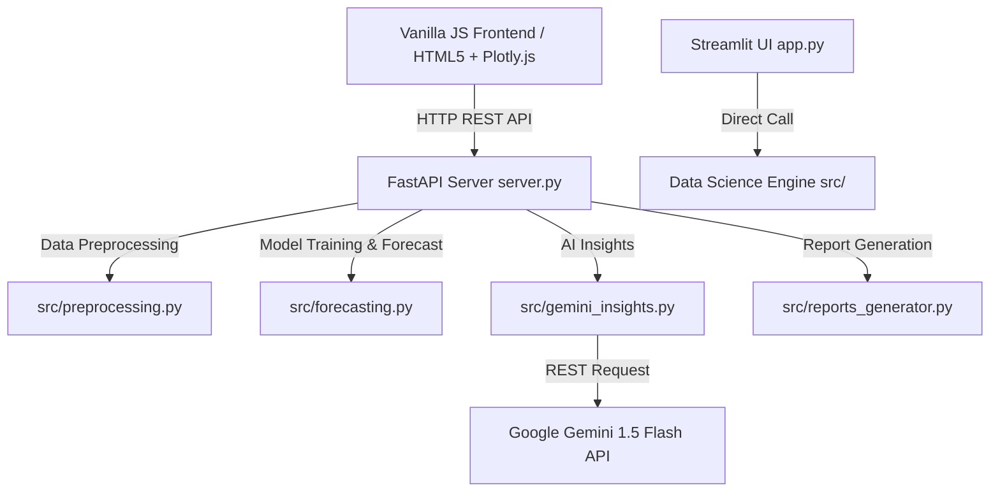

# Intelligent Sales Forecasting Dashboard

[](https://www.python.org/)
[](https://fastapi.tiangolo.com/)
[](https://streamlit.io/)
[](LICENSE)

An enterprise-grade, hybrid sales forecasting and business intelligence dashboard. Built with a modern **FastAPI** REST backend, a sleek **Vanilla JS + Plotly.js** glassmorphic frontend UI, and a secondary **Streamlit** dashboard fallback. Powered by four machine learning forecasting models and Google Gemini 1.5 Flash AI insights.

---

## 🌟 Key Features

- 📊 **Executive BI Dashboard**: Real-time sales KPIs (Revenue, Profit, Units Sold, Average Order Value, Operating Margin) with YoY growth trends and interactive region/category filtering.
- 🤖 **4 ML Forecasting Engines**:
  - **Prophet / Trend-Seasonal**: Captures annual/weekly seasonality and long-term trend lines.
  - **Random Forest Regressor**: Detrended, non-linear ensemble with leaf regularization.
  - **XGBoost Regressor**: Gradient boosting with L1/L2 regularization and subsampling.
  - **MLP Neural Network**: Multi-Layer Perceptron with standard scaling and detrending.
- ⚡ **Interactive What-If Revenue Simulator**: Simulate the impact of discount strategies, marketing spend, and price changes on future revenue.
- 📑 **AI Report Generator**: Generates executive-ready sales reports (Executive, Regional, Product Breakdown) via Google Gemini 1.5 Flash API or structured fallback rules.
- 💡 **AI Insights Engine**: Hybrid AI module delivering 4 actionable business recommendations per view using Gemini API or rule-based heuristics.
- 📁 **Universal Data Ingestion & Mapping**: Supports custom CSV and Excel file uploads with auto-mapping heuristics for date and sales columns.
- 🧪 **Overfitting & Stress Test Suite**: Benchmark suite to evaluate model stability under clean seasonality, high noise, and structural trend breaks.

---

## 🏗️ High-Level Architecture



---

## 📁 Repository Structure

```text
intelligent-sales-forecasting-dashboard/
├── server.py                     # Modern FastAPI web application backend
├── app.py                        # Legacy Streamlit frontend application
├── requirements.txt              # Project dependencies
├── README.md                     # Technical documentation
├── .env                          # Environment variables configuration
├── frontend/                     # Custom Vanilla JS Frontend UI
│   ├── index.html                # HTML5 structure & layout
│   ├── app.js                    # State management, Plotly rendering, API fetch calls
│   └── style.css                 # Glassmorphic dark design system & responsive styling
├── src/                          # Modular Data Science Core
│   ├── preprocessing.py          # Data ingestion, cleaning, feature engineering
│   ├── forecasting.py            # ML forecasting algorithms (Prophet, RF, XGB, MLP)
│   ├── visualization.py          # Plotly figure wrappers (Streamlit interface)
│   ├── gemini_insights.py        # Gemini API integration & cache engine
│   ├── reports_generator.py      # HTML/Text report compilation
│   ├── sample_generator.py       # Synthetic realistic transaction data generator
│   ├── generate_test_datasets.py # Stress test dataset generator
│   └── check_overfitting.py      # Overfitting evaluation benchmark script
├── tests/                        # Unit test suite
│   └── test_components.py        # Automated test suite (8 tests)
└── data/                         # CSV/Excel data directory
```

---

## ⚙️ Installation & Setup

### 1. Prerequisites
- Python 3.9 or higher installed.

### 2. Install Dependencies
```bash
pip install -r requirements.txt
```

### 3. Configure Environment Variables
Create or edit the `.env` file in the root directory:
```env
GEMINI_API_KEY=your_google_gemini_api_key_here
GEMINI_MODEL=gemini-1.5-flash
```
*Note: If `GEMINI_API_KEY` is not provided or API calls fail, the dashboard seamlessly falls back to a deterministic rule-based insight & report generator.*

---

## 🚀 Running the Application

### Option A: Modern Web Application (FastAPI + JS Frontend) — Recommended
Start the FastAPI server:
```bash
uvicorn server:app --reload --port 8000
```
Open your browser and navigate to:
```text
http://127.0.0.1:8000/
```

### Option B: Legacy Streamlit Application
Start the Streamlit dashboard:
```bash
streamlit run app.py
```

---

## 🧪 Testing & Verification

### Run Unit Tests
To execute the automated unit test suite:
```bash
python -m unittest discover tests
```

### Run Model Overfitting & Stress Test Benchmark
To evaluate models against noisy data and structural trend breaks:
```bash
python src/check_overfitting.py
```

---

## 🔌 API Reference Summary

| Endpoint | Method | Description |
| :--- | :--- | :--- |
| `GET /api/config` | GET | Returns dataset date bounds, available regions, and product categories |
| `POST /api/dashboard` | POST | Returns calculated KPIs, trends, map data, product breakdowns, and AI insights |
| `POST /api/forecast` | POST | Executes model training (Prophet, RF, XGB, MLP) and returns multi-month predictions |
| `POST /api/analytics` | POST | Returns category trend breakdown, elasticity, and discount analysis datasets |
| `POST /api/report` | POST | Generates an executive summary HTML report |
| `POST /api/upload` | POST | Handles CSV/Excel file uploads and auto-detects column mappings |
| `POST /api/reset-datasource` | POST | Reverts dataset to default sample data |

---

## 📜 License
Distributed under the MIT License.
